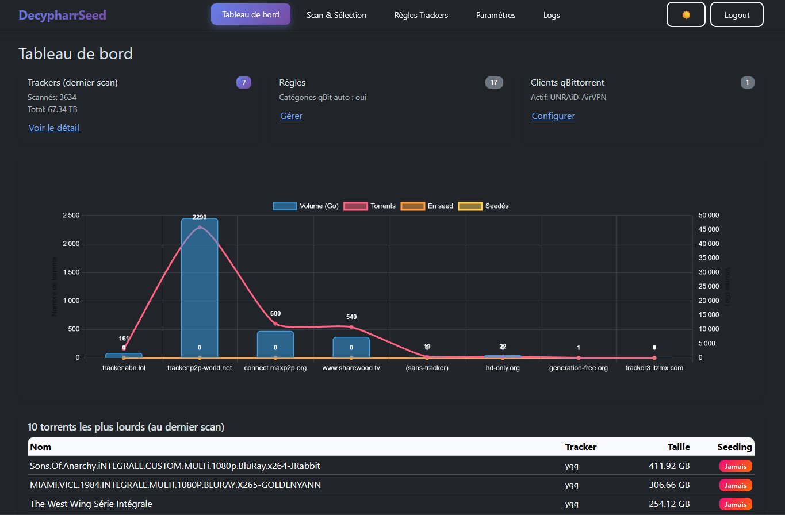
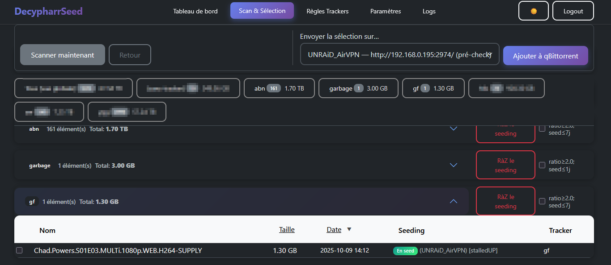
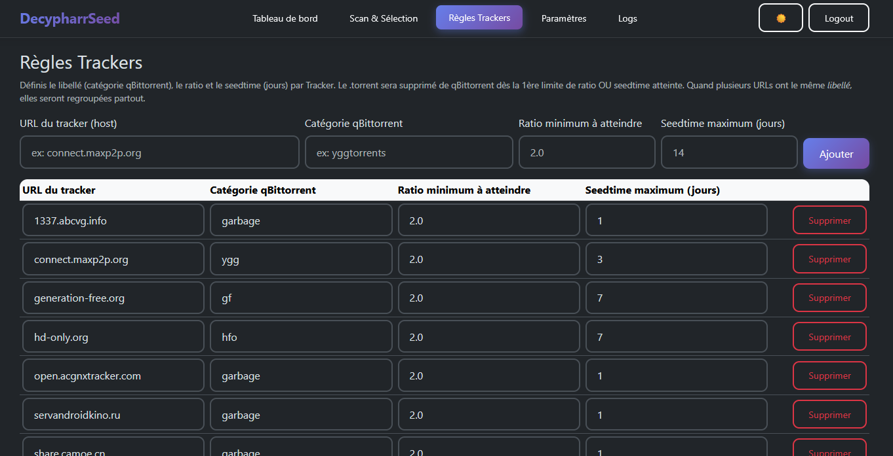
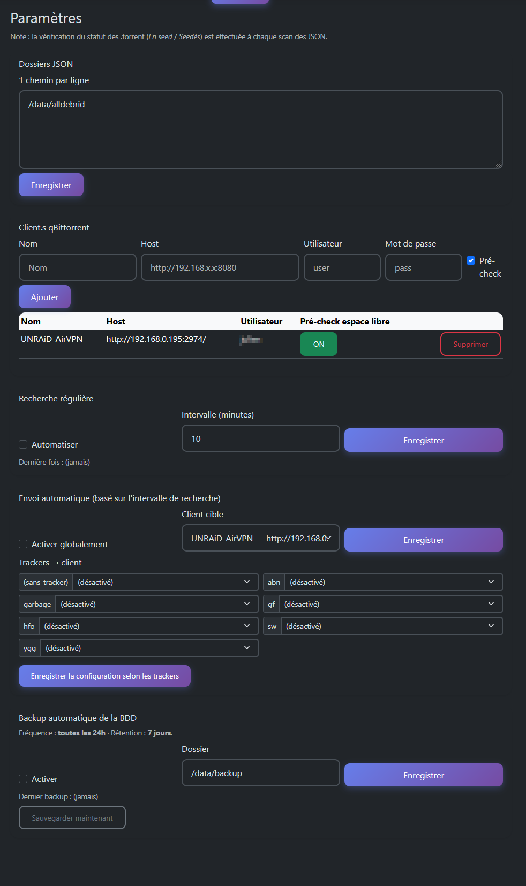
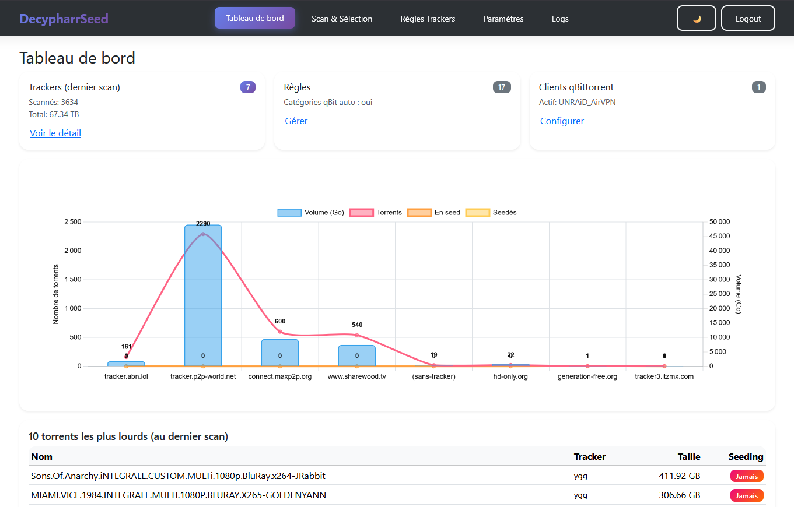

# 🌱 DecypharrSeed — Beta

**DecypharrSeed** est un outil web minimaliste de **gestion, suivi et envoi de torrents** basé sur les fichiers JSON issus de [**Decypharr**](https://github.com/sirrobot01/decypharr) ou d’autres outils équivalent (non testés).  
Son objectif : centraliser, visualiser, et gérer facilement la diffusion de contenus seedés depuis une seedbox ou un environnement Docker, tout en conservant une traçabilité locale.


## 🐳

```yaml
services:
  decypharrseed:
    image: ghcr.io/aerya/decypharrseed:latest
    container_name: decypharrseed
    restart: always
    ports:
      - "8069:8069"
    environment:
      MCC_USER: "aerya"
      MCC_PASS: "aerya"
      MCC_PORT: "8069"
      MCC_HOST: "0.0.0.0"
# Pour plusieurs => /data/alldebrid:/data/realdebrid:/data/abc
      MCC_JSON_DIRS: "/data/alldebrid"
    volumes:
      - /home/aerya/docker/DecypharrSeed:/data
      - /home/aerya/docker/decypharr/configs/cache/alldebrid:/data/alldebrid:ro
# Si autre débrideur qu'AD ou plusieurs, adapter ou ajouter des volumes
```


## 🚀 Fonctionnalités principales

### 🔍 Scan & Indexation
- Analyse automatique des fichiers JSON (AD, RD, TB etc)
- Regroupement par **tracker d’origine**
- Affichage clair : nom, taille, date, statut, client associé
- Tri instantané et filtres par tracker
- Statuts dynamiques :  
  - 🟢 **En seed (actif)**  
  - 🟠 **Seedé (historique))**  
  - 🔴 **Jamais seedé**

### 🌐 Intégration qBittorrent
- Support **multi-clients qBittorrent**
- Ajout automatique ou manuel de torrents
- Application automatique des :
  - Catégories (par règle)
  - Limites de ratio et de seedtime
  - Tag universel `DecypharrSeed`
- Vérification d’espace disque avant envoi
- Détection en temps réel des torrents actifs (`uploading`, `stalledUP`, etc.)
- Lien direct vers l’interface du client

### ⚙️ Règles & Automations
- Règles par **tracker** : catégorie, ratio, seedtime
- Import automatique des trackers détectés
- Auto-scan planifié
- Auto-envoi configurable (global ou par tracker)
- Sauvegarde SQLite quotidienne avec rétention

### 📊 Tableau de bord
- Graphique combiné :
  - **Torrents** (torrents détectés)
  - **En seed** (actuellement actifs)
  - **Seedés** (torrents déjà envoyés)
  - **Volume total (Go)** par tracker
- Tableaux dynamiques :
  - Top 10 plus lourds
  - Derniers ajouts
  - 3 derniers par tracker
- Mode sombre / clair dynamique

### 🛠️ Autres
- Interface web responsive (Flask + Bootstrap)
- Authentification simple
- Sauvegarde et restauration automatiques
- Logs live (rafraîchissement toutes les 2s)
- Fichier SQLite unique (`~/.decypharrseed.sqlite`)


## 🗺️ Roadmap

- [ ] **Améliorer la détection des trackers**
  - Normaliser hosts (lowercase, strip ports, `www.`)
  - Déduire le tracker depuis le magnet (`tr=`), fallback via règles locales
  - Regrouper plusieurs domaines d’un même tracker (alias)
  - Mettre en cache les résolutions d’alias en BDD

- [ ] **Ergonomie / Scan**
  - Correction CSS
  - Indicateur clair “dernière vérif seed depuis scan JSON”
  - Tri et recherche côté client plus rapides (table virtualisée si >1k lignes)

- [ ] **Règles trackers avancées**
  - Alias multi-hosts par libellé
  - Règles par *pattern* (regex nom release)
  - Priorité de règle (override)

- [ ] **Intégration qBittorrent**
  - Détails torrent (ratio courant, ETA, peers) en tooltip
  - Actions rapides (pause/force recheck) optionnelles

- [ ] **Sécurité & auth**
  - Hash/pepper pour le mot de passe (au lieu d’ENV en clair)

- [ ] **Multi-clients & connecteurs**
  - Transmission / rTorrent

- [ ] **Divers**
  - Page “Santé” (connexions clients, latence API, espace disque)
  - Webhooks/notifications (Discord/Notify) sur événements clés
  - Déduplication basée sur `infohash` + normalisation noms (NFD, accents)
  - Traduction FR/EN


## 🖼️ Aperçu

    